# Red Wine Quality
The dataset is related to red variant of the Portuguese "Vinho Verde" wine. For more details, consult the reference [Cortez et al., 2009]. Due to privacy and logistic issues, only physicochemical (inputs) and sensory (the output) variables are available (e.g. there is no data about grape types, wine brand, wine selling price, etc)

# Data source
https://www.kaggle.com/uciml/red-wine-quality-cortez-et-al-2009

https://archive.ics.uci.edu/ml/datasets/wine+quality

# Introduction
Data set contains physicochemical of 1599 records of red wines. Initiially, dataset included a dependent feature [quality], which is a score between 0 to 10. The higher the score, the better the wine. However, most of the scores are concentrated between 5 or 6, 

Project has turned this into a classification problem, by setting an arbitrary cutoff for [quality] at 7 or higher getting classified as 'good/1' and the remainder as 'bad/0'.

# Objective
Aim to detect the few good wines among an imbalanced dataset using various sampling methods belows and observe which yield better recall score for minority class. 

1. Random Over Sampling

2. SMOTE + Tomek Links

3. SMOTE with random under sampling of majority class

4. ADASYN

Logistic regression model is used throughout the project.  

# Libraries
numpy, seaborn, matplotlib, plotly.express, sklearn, imblearn

# Exploratory Data Analysis

Key analysis: 

1. Quality is dominated by values 5 and 6

    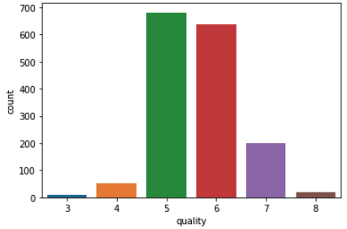

2. Features are in different scales, hence scaling is required. 

    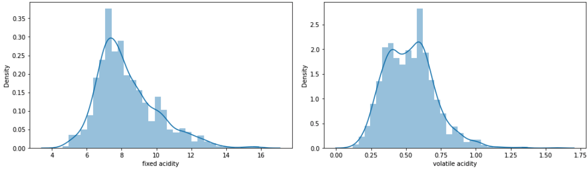

3. Good correlation between alcohol and quality

    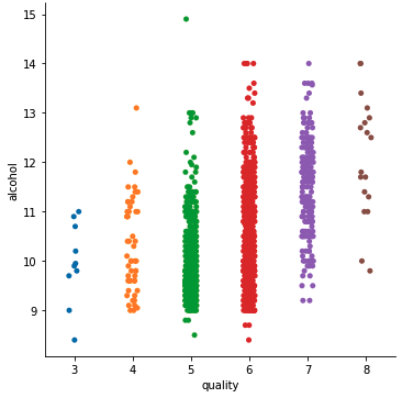

4. High values of sulphates, alchohol, citric acid do lead to better quality  

    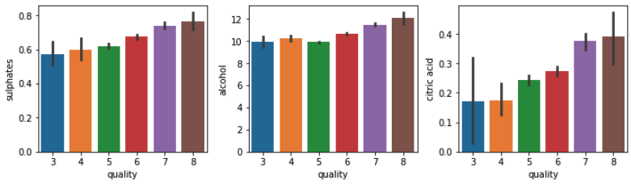

5. Better quality wines are mostly above 0.2, 0.4 citric acid, with lower pH and higher fixed acidity

    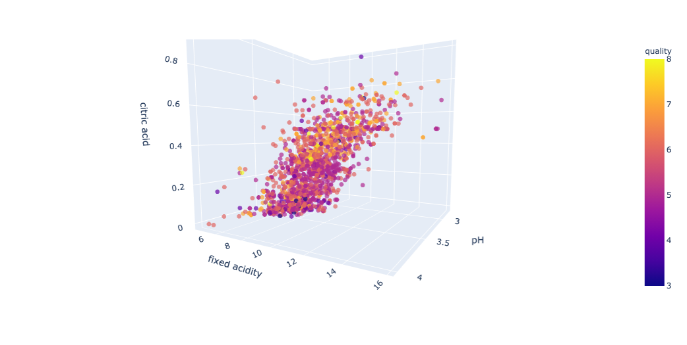

For full analysis: please find: https://github.com/chekwei4/Wine_Quality/blob/main/Wine_Quality_EDA.ipynb

# Main Analysis
## Introduction

2 bins have been created based on the quality of the wines. 

Good wines - 217 (13.6%)

Bad wines - 1382 (86.4%)

    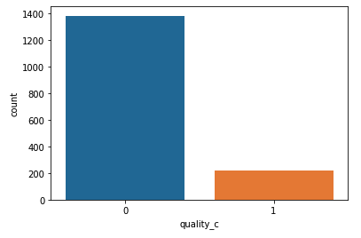

This is a case of imbalanced dataset. 

We will be using logistic regression across all sampling techniques to maintain consistency, and we will focus on recall and F1 score, instead of accuracy for this imbalance dataset. 

## Baseline model without sampling techniques

Baseline model with logistic regression performed as below: 

    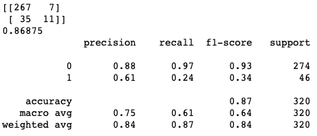

Recall for good wines is very bad with 0.34, meaning out of all the good wines in the test dataaset, our model only picked up and recognised 34% successfully. As a result, we see 11 among 45 real good wines are classified successfully.

F1 score for good wine is very bad, at 34%, but it's 93% for the majority class (bad wines) as expected. 

## Method 1 - RandomOverSampler
As our dataset is small, it is not a good idea to perform under sampling, because under sampling will essential reduce and give up info, causing our model to learn from even fewer data.

"The undersampling method is conducted by removing some random examples from the majority class, at cost of some information in the original data are removed as well." <em>(credit: https://towardsdatascience.com/imbalanced-classification-in-python-smote-tomek-links-method-6e48dfe69bbc)</em>

    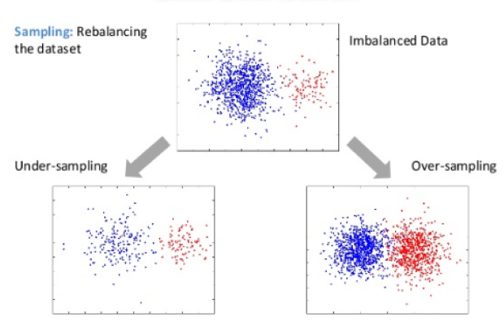
<!--  -->

<em>(credit: https://www.datasciencecentral.com/profiles/blogs/handling-imbalanced-data-sets-in-supervised-learning-using-family)</em></o>
 
 
After applying random over sampling, the model performed as below: 

    
<!--  -->

Recall for good wines is now 74% (this is a huge improvement from pre sampling which was around 20%. We now see that our model is able to recognise 34 among 46 real good wines, hence are classifying them successfully.

F1 score for good wines also improved to 54% from baseline model of 24%.

The trade off?

For the bad wine predictions (class = 0), we see recall dropped from 97% -> 84%.

Our model becomes worse at recognising the bad wines. Out of all the 274 bad wines in test dataset, our model is only able to recognise 229 of them and classify them as bad.

F1 score for bad wines also dropped to 84%.

## Method 2a - SMOTE + Tomek Links
Synthetic Minority Oversampling Technique

Unlike random oversampling that only duplicates some random examples from the minority class, **SMOTE generates examples based on the distance of each data (usually using Euclidean distance) and the minority class nearest neighbors, so the generated examples are different from the original minority class.**

This method is effective because the synthetic data that are generated are relatively close with the feature space on the minority class, **thus adding new “information” on the data, unlike the original oversampling method.**

Tomek Links

This method can be used to find desired samples of data from the majority class that is having the lowest Euclidean distance with the minority class data (i.e. the data from the majority class that is closest with the minority class data, thus make it ambiguous to distinct).

Hence, the majority of class observations from these links are removed as it is believed to increase the class separation near the decision boundaries.

This hybridization techniques involve combining both undersampling and oversampling techniques.

<em>(credit: https://towardsdatascience.com/imbalanced-classification-in-python-smote-tomek-links-method-6e48dfe69bbc)</em>

    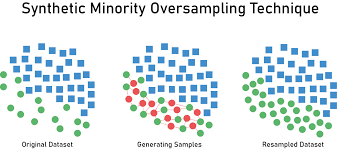

<em>(credit: https://heartbeat.fritz.ai/resampling-to-properly-handle-imbalanced-datasets-in-machine-learning-64d82c16ceaa)</em>
 

 
After applying SMOTEToemk, the model performed as below: 

    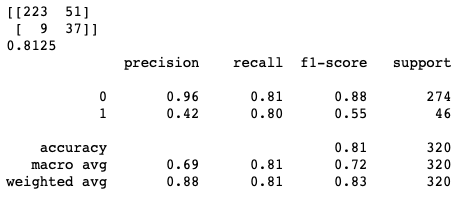
<!--  -->

After applying SMOTETOmek, things look even better for our minority class predictions.

Recall for good wines is now 80%. This is a 6% improvement from random over sampling.

Our model is now able to pick up and recognise 80% of the good wines successfully, as we see 37 among 46 good wines are classfied correctly.

F1 score for the good wines predictions improved by 1% to 55% here. 

Recall for the majority class (good wines) has further drop from 84% -> 81% when compared with random over sampling. 

## Method 2b - SMOTE with RandomUnderSampler
Here, we are doing 2 things in a pipeline.

1. SMOTE

2. Under sampling of the majority class aka bad wines

What we did here was that increasing minority with SMOTE, and then decreasing majority with random under sampling. 

| Steps                        | Cnts of class labels |  
|---------------------------------------|-------------------|
| Raw train data                        | {0: 1108, 1: 171} |
| After SMOTE                           | {0: 1108, 1: 775} |
| After SMOTE and random under sampling | {0: 968, 1: 775}  |

Performance as below:

    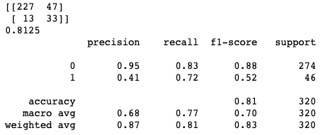
<!--  -->

Not much significant improvement observed. 

In fact, good wine prediction is worse off, as now recall is 72%. Model is only able to recognise 33/45 good wines in test dataset.

F1 score for good wines dropped to 52%. 

## Method 3 - ADASYN
Adaptive Synthetic Sampling Approach

The essential idea of ADASYN is to produce an appropriate number of synthetic alternatives for each observation belonging to the minority class. The concept of “appropriate number” here depends on how hard it is to learn the original observation. In particular, an observation from the minority class is “hard to learn” if many examples from the majority class with features similar to that observation exist

(credit: https://medium.com/quantyca/oversampling-and-undersampling-adasyn-vs-enn-60828a58db39)

    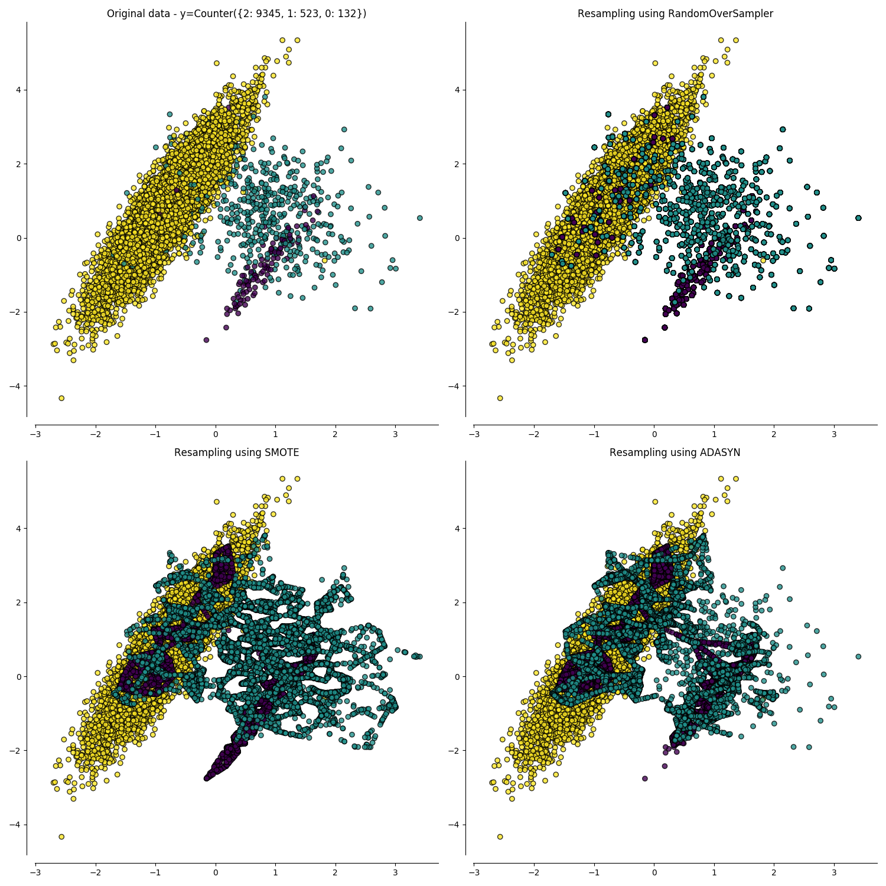
<!--  -->

<em>(credit: https://medium.com/quantyca/oversampling-and-undersampling-adasyn-vs-enn-60828a58db39)</em>

After performing ADASYN sampling, results as below:

    
<!--  -->

For recall of the good wine predictions, it improves further now to 80%. This is the best sampling technique so far for recall, with 37/46 good wines correctly classfied in the test dataset.

# Overall Comparison
| Sampling techniques          | F1 Score - 0/Bad Wine | F1 Score - 0 - 1/Good Wine | Recall for Good Wine |   
|------------------------------|------------------------|-----------------------------|--------------------|
| Baseline                     | 0.93                   | 0.34                        | 0.24               |   
| Random Over Sampler          | 0.89                   | 0.54                        | 0.74               |   
| SMOTETomek                   | 0.88                   | 0.55                        | 0.80               |   
| SMOTE + Random Under Sampler | 0.88                   | 0.52                        | 0.72               |   
| ADASYN                       | 0.87                   | 0.54                        | 0.80               |   

# Conclusion
ADASYN and SMOTETomek seem to be able to populate samples which allow our model to train better and learn better on the minority class aka good wines, hence producing better results at identify good wines in the test dataset.

We can also see that generally there's a trade off between performance for predicting good and bad wines.

Eg. when the model learns better at predicting good wines, they will do worse at predicting bad wines.

# Future enhancement 
Project could try to improve and work on below: 

1. other classification models to achieve better results

2. much larger dataset to show drastic difference in results for the sampling techniques

3. explore other sampling techniques like SMOTE with elective Synthetic Sample Generation
    - Borderline-SMOTE
    - Borderline-SMOTE SVM
    - others